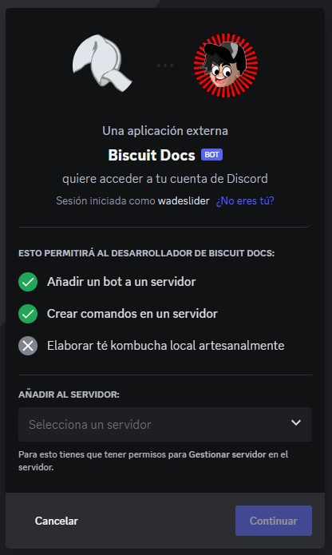
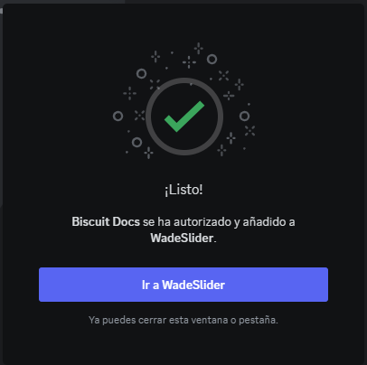
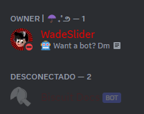

import { Callout } from 'nextra/components'

# Añadiendo tu bot a servidores

Después de [configurar](/configuracion) tu aplicación, te darás cuenta de que aún no está en ningún servidor. ¿Cómo funciona?

Antes de que puedas ver tu bot en tus propios servidores (o en los de otros), tendrás que añadirlo creando y utilizando un enlace de invitación único con el identificador de cliente de tu aplicación de bot.

## Links de invitación

La version basica es:

```
https://discord.com/api/oauth2/authorize?client_id=123456789012345678&permissions=0&scope=bot%20applications.commands
```

La estructura de la url es simple:

- ` https://discord.com/api/oauth2/authorize ` Es la estructuera estanadar para los enlaces de invitacion.
- ` client_id=... ` Este es el id para saber a quin quieres invitar.
- ` permissions=... ` Esta describe los permisos del bot.
- ` scope=bot%20applications.commands ` Especifica que es y que va hacer.

<Callout type="warning" emoji="⚠️">
  **PRECAUCION**

  Si recibes un mensaje de error que dice "Bot requires a code grant", dirígete a la configuración de tu aplicación y desactiva la opción "Require OAuth2 Code Grant". No deberías activar esta opción a menos que sepas por qué lo necesitas.
</Callout>

## Creando y utilizando tu link de invitacion

Para crear un enlace de invitación, vuelve a la página [Mis aplicaciones](https://discord.com/developers/applications/me) en la sección "Aplicaciones", haz clic en tu aplicación bot y abre la página OAuth2/URL Generator.

En la barra lateral, encontrarás el generador de URL OAuth2. Selecciona las opciones ` bot ` y ` applications.commands `. Una vez seleccionada la opción ` bot `, aparecerá una lista de permisos que te permitirá configurar los permisos que necesita tu bot.

Coge el enlace mediante el botón "Copiar" e introdúcelo en tu navegador. Deberías ver algo como esto (con el nombre de usuario y el avatar de tu bot):



Le das click en autorizar. Solo si tienes permiso de "Manejar el servidor". Despues de eso te saldra el mensaje de confirmacion.



¡Felicidades! Ya has añadido tu bot a un sevidor y lo podras ver de la siguiente forma:

