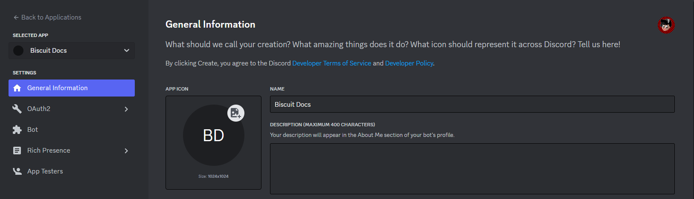

import { Steps, Callout } from 'nextra/components'

# Configurando tu aplicacion

## Creando tu bot

Ahora que ya tenemos Node y Biscuit instalado, ya podemos empezar a codificar, el siguiente paso es hacer tu aplicacion desde el sitio oficial de Discord.

Hacerlo no es dificil. Los pasos son:

<Steps>
### Paso 1
 
Abre [Discord Developer Portal](https://discord.com/developers/applications) y inicia sesion en tu cuenta.
 
### Paso 2
 
Presiona en el boton "New Application".

### Paso 3

Introduzca un nombre y confirme la ventanda emergente pulsando el botón "Create".
</Steps>

Tu pagina lucira asi:

Tu puedes editar la foto y el nombre de tu aplicacion aqui. Ya que lo hallas guardado no moveremos al aparatdo de "Bot".

## El token de tu bot

<Callout type="error" emoji="️⚠️">
**PELIGRO**

Esta sección es crítica, así que presta mucha atención. Explica qué es tu token bot, así como sus aspectos de seguridad.
</Callout>

En este panel, puedes dar a tu bot un avatar elegante, establecer su nombre de usuario y hacerlo público o privado. El token de tu bot se revelará cuando pulses el botón "Restablecer token" y confirmes. Cuando te pidamos que pegues el token de tu bot en algún sitio, este es el valor que tienes que poner. Si pierdes el token de tu bot en algún momento, tienes que volver a esta página y restablecer el token de tu bot de nuevo, lo que revelará el nuevo token, invalidando todos los antiguos.

## ¿Qué es el token?

Un token es esencialmente la contraseña de tu bot; es lo que el bot utiliza para iniciar sesion en Discord. Dicho esto es vital que **NUNCA** compartas ese token con nadie, ni a propósito ni accidentalmente. Si alguien consigue hacerse del token de tu bot, podrá utilizarlo como si fuera suyo, lo que significa que podra hacer actos maliciosos con el.

Los tokens tienen este aspecto: ` ZzkyNzF1NDU0MTk2SDg4ODQh-A.fghA.Ovy4MCQywSkoEFGclAtl6hOOK7I ` (no te preocupes, reseteamos este token inmediatamente antes de publicarlo aquí). Si es más corto y se parece más a esto: ` kxbsDRU5UfAaiO7ar9GFMHSlmTwYaIYn `, has copiado tu secreto de cliente en su lugar. Asegúrate de copiar el token si quieres que tu bot funcione.

## Escenario de fuga de tokens

Imaginemos que tienes un bot en más de 1.000 servidores, y que te ha llevado muchos, muchos meses de codificación y paciencia conseguirlo en esa cantidad. El token de tu bot se filtra en algún sitio, y ahora lo tiene otra persona. Esa persona puede:

- Hacer spam en todos los servidores en los que esté tu bot;
- DM spam a tantos usuarios como sea posible;
- Borrar tantos canales como sea posible;
- Expulsar o banear a tantos miembros del servidor como sea posible;
- Hacer que tu bot abandone todos los servidores a los que se ha unido;
- Todo eso y mucho, mucho más. Suena bastante terrible, ¿verdad? Así que asegúrate de mantener el token de tu bot lo más seguro posible.

<Callout type="error" emoji="️⚠️">
**PELIGRO**

Si el token de tu bot se ha visto comprometido al enviarlo a un repositorio público, publicarlo en el soporte de discord.js, etc., o ves que el token de tu bot está en peligro, vuelve a esta página y pulsa "Restablecer token". Esto invalidará todos los tokens antiguos pertenecientes a tu bot. Ten en cuenta que tendrás que actualizar el token de tu bot donde lo usabas antes.
</Callout>